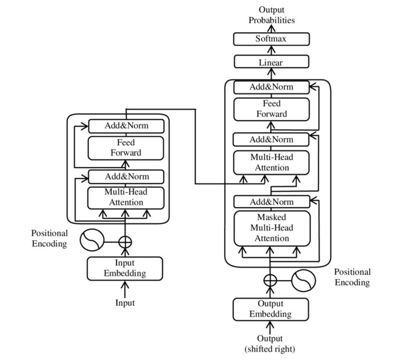

# code-attention

code-attention is an experimental tool designed to calculate the relative importance of text sequences within text frames.  
It achieves this by utilizing attention layers found in Transformer models.

## Abstract

</img>

The [Transformer](https://arxiv.org/pdf/2304.10557) model architecture has revolutionized the field of Natural Language Processing (NLP) with models like GPT and BERT.  
At its core, the architecture employs attention layers which enable the model to attain state-of-the-art contextual understanding by scoring the relationship between tokens.  
This tool uses this mechanism to derive the importance scores of text sequences (e.g lines).  
Possible use cases include:

- code snippet importance analysis,
- seeking most relevant lines in documents

### Requirements

- transformers
- torch

## Installation

The tool can be quickly installed with this simple command executed in the project's root directory:

```sh
$ pip install -e .
```

## Usage example

After installation a simple invocation looks like this:

```sh
$ code-attention file
```

This command will evaluate the default model (codebert-base) and print all lines from the file, prefixed with a colored importance score.    
Since scores can be close to each other, you can use the --rank-color option to base the color on the position in the importance ranking.  
Use `-h` option to list all available options.

## Notes

It's important to note that the transformer has a limited context window capacity.  
If the count of tokens in the input file exceeds this capacity, the tool must split them.  

The current approach is to use sliding windows with a specific overlap. the importance values for the
overlapped tokens are then averaged.

Some context from the full document may be lost between windows; thus the output of large document 
may not be as precise as for smaller ones that fit within the model's capacity.  
It's advisable to test the tool in practice to empirically evaluate its overall accuracy.

## To do

- [ ] the vim plugin
- [ ] add support for other sequence delimiters (beyond the new line)
- [ ] add more options
- [ ] expand this tool to include more methods of handling inputs beyond the model's window size

## Copyright 

Grzegorz Kociołek (Dark565), 2024

## License

This project is licensed under the MIT License. See the LICENSE file for details.
